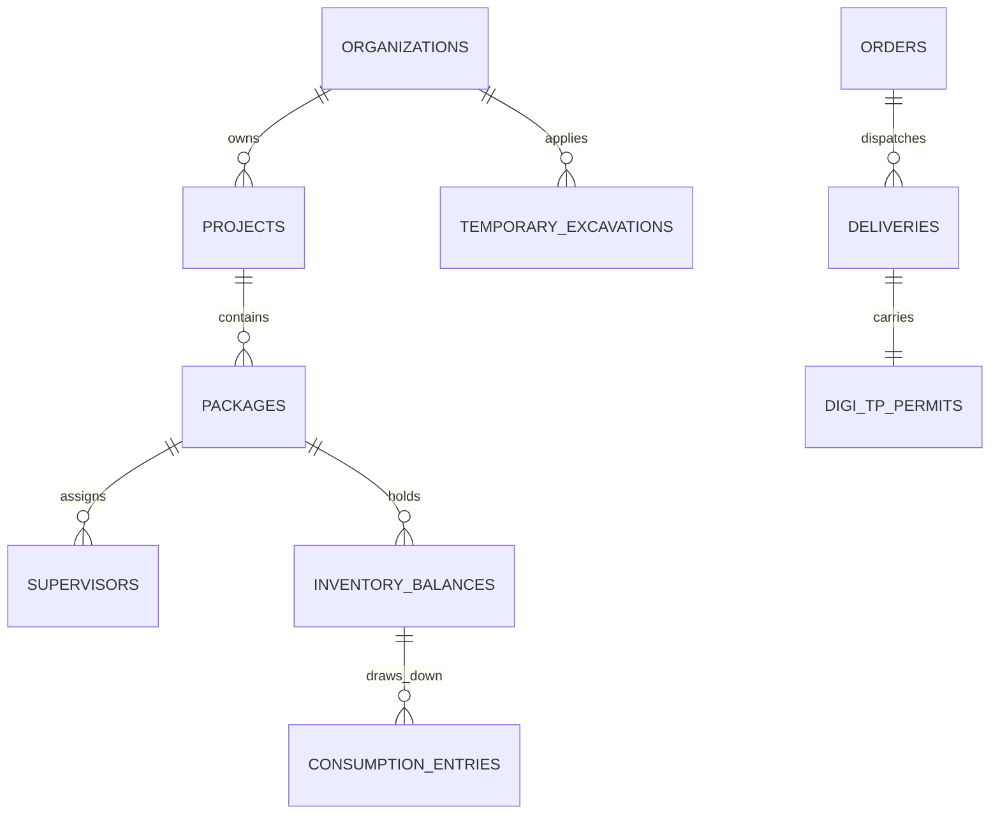

# Mahakhanij Consumer App 2.0 — Developer Handoff Document
**Single Source of Truth for Web, Backend, and Mobile (Flutter) Engineering Teams**

---

## 1. Executive Overview & Product Vision

### 1.1 What is Mahakhanij Consumer App (CA 2.0)?
The **Mahakhanij Consumer App** is the official digital gateway for procuring, tracking, and managing minor minerals (sand, aggregate, murrum, stone, etc.) in the State of Maharashtra, adhering strictly to the Maharashtra Minor Mineral Extraction and Transport Rules.

### 1.2 Core Objectives
1. **100% Legal Sourcing & Compliance Verification**: Every mineral batch delivered to an individual consumer or commercial infrastructure site is linked to an authentic electronic Transit Pass (**DigiTP / e-TP**).
2. **On-Site Inventory & Consumption Accountability**: Construction firms, infrastructure EPCs, and builders can track material stock per project and per work package, record daily consumption draw-downs, and prove statutory provenance during government site audits.
3. **Statutory Temporary Excavation System**: Government/private contractors requiring temporary mineral excavation permits can apply through a multi-step statutory wizard, auto-save in-progress drafts, track review status through an interactive pipeline, pay royalty demand notes, and download official excavation orders.
4. **Dual Persona Support**: The application adapts seamlessly between two distinct operating paradigms:
   - **Individual Citizen / Private Consumer**: Buying minerals for personal housing/renovation.
   - **Commercial Organization / Corporate Contractor**: Managing multi-package infrastructure projects, site supervisors, bulk deliveries, on-site storage, and statutory extraction applications.

### 1.3 Key Updates in Current Release (Latest App Design)
The following recent architectural and UX refinements are fully reflected in this codebase:
- **More Screen Reorganization (`MoreScreen.tsx`)**:
  - Swapped positions: **Supervisors** and **Temporary Excavation Application**.
  - Renamed the menu item to **"Temporary Excavation Application"**.
  - Removed the redundant duplicate section *"Account & Identity / My Profile & KYC"* (KYC verification is now accessed cleanly from the top profile card).
- **Auto-Saving Draft System (`useApplicationForm.ts`, `temporaryExcavationRepository`)**:
  - Automatically saves form progress in real time as the user fills it out.
  - Retains `lastStepIndex` memory so users returning halfway through resume at the exact step they left off.
  - Added a resume prompt modal when tapping *"+ New application"* if an active draft exists.
- **Compact Pipeline Dashboard & Filters (`TemporaryExcavationScreen.tsx`)**:
  - 4 Stage Data Cards: **04 Pending**, **01 Payment Due**, **02 Permit Ready**, **01 Rejected**.
  - 3 Filter Pills directly beneath: **All (8)**, **Drafts (1)**, **Action Required (3)**.
  - Fixed borders to use the app's standard design token **`border-line`** (`#dde3ee`), eliminating pitch-black outlines.
  - Fixed active state styling (`bg-[#1241a6] text-white border-[#1241a6]`) so buttons remain visible when clicked.
  - Tapping an active card or pill toggles back to `All`.
- **Clean Layout & Draft Card Alignment (`TemporaryExcavationScreen.tsx`)**:
  - Removed the separate hero banner from above the search bar for a clean, consistent hierarchy.
  - Incomplete drafts are isolated strictly under the **Drafts** tab (`activeTab === 'DRAFTS'`), keeping the **All** tab focused on submitted permits.
  - Draft cards render as standard **`ApplicationCard`** components.
  - The **"Resume Application →"** button is placed on the far right of the bottom row (aligned on the same line as `Updated: [Date]`), matching the placement on all other cards.
  - The **"Discard"** action is positioned cleanly in the card header next to the `Draft Saved` badge.

---

## 2. Architecture & Technology Stack

```
src/
├── domain/         # Product entities as pure TypeScript types (No UI, No state, No data)
├── rules/          # Business rules, calculations, permissions as pure functions
├── data/           # Repositories, in-memory DB (db.ts), fixtures, network simulation
├── state/          # Session, authenticated user, active organization context (Zustand)
├── design-system/  # Design tokens (tokens.css) + pure visual UI components
├── navigation/     # App shell, routing registry, bottom tabs, capability guards
├── screens/        # Route-level screens composing UI and calling repositories via useAsync
├── prototype/      # Persona switcher and prototype tooling (isolated from product logic)
└── content/        # Shared localization strings and copy
```

### 2.1 Technology Stack
- **Framework**: React 19 + TypeScript (Strict Mode)
- **Bundler & Tooling**: Vite 6.4 (ESM native, fast HMR)
- **CSS Engine**: Tailwind CSS v4 with custom `@theme` tokens in `src/design-system/tokens.css`
- **Routing**: `react-router-dom` v7 with centralized route builders in `src/navigation/routes.ts`
- **Icons**: `lucide-react`
- **State Management**: Lightweight Zustand stores (`useSessionStore`, `useOperatingContext`)
- **Async Data Lifecycle**: Custom `useAsync` hook with standard `LoadingState` / `ErrorState` handling

### 2.2 Architectural Discipline (Strict Downward Dependencies)
| Layer | Owns | Must Never |
|---|---|---|
| `domain/` | Entity interfaces, discriminated unions, Value Objects | Import UI, state, or repository code |
| `rules/` | Business rules, calculations, validations, access matrix | Import React, DOM, or stores |
| `data/` | Repositories, mock DB, seed fixtures, async API simulation | Be imported directly in screen JSX (use `useAsync`) |
| `state/` | Session identity, active scope (Org/Project/Package) | Cache operational entity lists |
| `design-system/` | Visual vocabulary (`tokens.css`), dumb components | Know about business entities (e.g. Orders, Excavations) |
| `screens/` | Single route views, composition | Restate business rules or invent ad-hoc colors |

---

## 3. Visual Language & Design Tokens

The visual language is defined in `src/design-system/tokens.css`. It acts as the single source of truth for both Web and future Flutter implementations.

### 3.1 Strict Palette Discipline
Tailwind default colors are wiped (`--color-*: initial`). **Only tokens defined in `tokens.css` may be used.**

```css
/* Core Palette Tokens */
--color-neutral-0: #ffffff;
--color-neutral-25: #f8fafc;
--color-neutral-50: #f1f5f9;
--color-neutral-100: #eff2f7;
--color-neutral-200: #dde3ee;   /* Hairline separator (border-line) */
--color-neutral-300: #cbd5e1;   /* Emphasized border (border-line-strong) */
--color-neutral-600: #475569;   /* Supporting text */
--color-neutral-900: #0f172a;   /* Primary ink text */

/* Primary Institutional Blue */
--color-primary-50: #eef4fe;
--color-primary-100: #dce8fd;
--color-primary-500: #1a5fe8;
--color-primary-700: #1241a6;   /* Primary CTA & active badge tone */

/* Semantic Status Hues */
--color-success-50: #dcfce7;
--color-success-600: #15803d;   /* Permit Ready / Verified */

--color-warning-50: #fef3c7;
--color-warning-600: #b45309;   /* Pending / In Review / Action Required */

--color-danger-50: #fee2e2;
--color-danger-600: #b91c1c;    /* Rejected / Discrepancy */
```

> [!IMPORTANT]
> **Tailwind v4 Token Rule**: Never use generic Tailwind colors like `border-amber-200` or `bg-teal-500`. Always use defined semantic tokens (e.g., `border-line`, `border-warning-200`, `bg-primary-700`) or explicit brand hexes (`#1241a6`).

### 3.2 Flutter ThemeData Mapping
| Prototype Token | Flutter Equivalent | Description |
|---|---|---|
| `--color-canvas` | `theme.scaffoldBackgroundColor` (`#f8fafc`) | Page background |
| `--color-surface` | `theme.colorScheme.surface` (`#ffffff`) | Card & container fill |
| `--color-line` | `theme.dividerColor` (`#dde3ee`) | Standard hairline card border |
| `--color-primary-700` | `theme.colorScheme.primary` (`#1241a6`) | Institutional deep blue |
| `--color-ink` | `theme.colorScheme.onSurface` (`#0f172a`) | Primary text |
| `--color-ink-secondary` | `theme.textTheme.bodyMedium.color` (`#475569`) | Subtitles / metadata |
| `font-sans` | `GoogleFonts.plusJakartaSans()` | Clean modern sans font |
| `font-mono` | `GoogleFonts.jetBrainsMono()` | Numbers, pass IDs, challan codes |

---

## 4. User Personas & Capability Matrix

Access control is unified in `src/rules/access.ts`. It controls both tab visibility and route guarding (`RoleGuard`).

| Persona / Role | `userType` | Description & Key Capabilities |
|---|---|---|
| **Citizen Consumer** | `'CONSUMER'` | Individual buyer. Browses minerals, registers private project, requests quotes, tracks deliveries via DigiTP. No excavation or supervisor features. |
| **Commercial Organization** | `'COMMERCIAL_ORGANIZATION'` | Contractors, EPCs, builders. Full organization hierarchy (Projects, Packages, Supervisors), inventory draw-downs, statutory Temporary Excavation permits. |
| **Site Supervisor** | `'SUPERVISOR'` | Field staff assigned to a specific Package. Verifies truck arrivals via DigiTP QR code scanner, logs discrepancy reports. |

### Capability Flags (`hasCapability(user, capability)`):
- `TEMPORARY_EXCAVATION`: Apply, save drafts, pay demand notes, download excavation permits.
- `PROJECT_MANAGEMENT`: Create & edit corporate projects.
- `PACKAGE_MANAGEMENT`: Add packages, assign supervisors.
- `SUPERVISOR_MANAGEMENT`: Register site supervisors with employee codes (`SUP-XXXX`).
- `INVENTORY_CONSUMPTION`: Record on-site draw-downs against received balances.
- `STOCK_POINT_ENQUIRY`: Sourcing quotes from government-approved quarries.

---

## 5. Core Functional Modules & User Flows

### 5.1 Authentication & Scope Context
- **Path**: `/login`, `/register`, `/verify` (Mobile OTP simulation).
- **Prototype Persona Switcher**: Accessible at `/prototype/persona` or via the top-bar banner to effortlessly switch between Consumer, Organization, and Supervisor roles.
- **Operating Context (`useOperatingContext`)**: Resolves active `Organization -> Project -> Package`. Once selected, context propagates to all operational screens without re-prompting the user.

---

### 5.2 Organization Hierarchy & Personnel Management
- **Hierarchy Structure**: `Organization` (e.g. Shapoorji Pallonji EPC) → `Projects` (e.g. Metro Line 4) → `Work Packages` (e.g. Package 02 - Viaduct & Stations) → `Assigned Supervisors`.
- **Supervisor Registration**: Code automatically formatted as `SUP-XXXX` with mobile number and assigned package name.
- **Screen Locations**:
  - `src/screens/organization/OrganizationHomeScreen.tsx`
  - `src/screens/organization/ProjectsScreen.tsx`
  - `src/screens/organization/SupervisorsScreen.tsx`

---

### 5.3 Mineral Sourcing & Stock-Point Discovery
- **Stock Point Map (`StockPointMapScreen.tsx`)**: Interactive map with real-time distance calculations from user site to government stock points.
- **Mineral Catalog**: Categorized into Coarse Aggregate, River Sand, Manufactured Sand (M-Sand), Murrum, Stone, and Earth.
- **Pricing & Sourcing Compliance**: Includes legal sourcing verification badge asserting compliance with Maharashtra Minor Mineral Rules.

---

### 5.4 Enquiry & Quotation Engine
- **Workflow**:
  1. Consumer/Organization selects mineral & quantity (Brass / Metric Tonnes).
  2. Submits commercial enquiry with delivery vs. ex-stock preference.
  3. Stock point operator provides official quotation.
  4. User reviews quotation terms, accepts, and converts directly into an Order.

---

### 5.5 Orders, Payments & DigiTP Receiving Logistics
- **Order Tracking (`OrdersScreen.tsx`, `OrderDetailsScreen.tsx`)**: Displays ordered volume, supplier stock point, vehicle allocation, and payment status.
- **Live Vehicle Tracking (`DeliveryTrackingScreen.tsx`, `LiveVehicleTrackingScreen.tsx`)**: Simulates truck GPS journey from quarry to destination site.
- **DigiTP (e-TP) Electronic Pass**:
  - Every legal delivery generates a statutory DigiTP pass with QR code, vehicle number, driver details, and validity window.
- **Receiving Scan Panel (`QrScanPanel.tsx`, `ReceiveDeliveryScreen.tsx`)**:
  - Field supervisor scans QR code upon truck arrival.
  - Compares physical manifest quantity against delivered volume.
  - Option to confirm normal receipt (`RECEIVED`) or log shortage/damage (`RECEIVED_WITH_DISCREPANCY`).

---

### 5.6 On-Site Inventory & Consumption Tracking
- **Inventory Screen (`InventoryScreen.tsx`)**: Displays active balances grouped by project/package scope.
- **Legal Provenance Banner**: Displays "Verified 100% legal sourcing under Maharashtra minor mineral regulations (e-TP)".
- **Recording Consumption (`canRecordConsumption`)**:
  - Validates that daily material draw-down cannot exceed available quantity.
  - Records user ID, date, purpose, and updates remaining balance in real time.

---

### 5.7 Statutory Temporary Excavation Application System

The crown-jewel workflow for commercial entities requiring minor mineral excavation clearance.

#### Architectural Components:
- **Screen**: `src/screens/excavation/TemporaryExcavationScreen.tsx`
- **Wizard**: `src/screens/excavation/NewApplicationScreen.tsx`
- **Form State Hook**: `src/screens/excavation/useApplicationForm.ts`
- **Business Rules**: `src/rules/excavation.ts`

#### The 5 Statutory Steps:
1. **Applicant Details**: Name, PAN/Aadhaar, organization details, mobile number, operating context.
2. **Excavation Details**: Mineral selection, estimated volume in Brass/Tonnes, excavation method (Manual / Semi-Mechanized), proposed depth in meters, start & end dates.
3. **Quarry & Location**: Village, Taluka, District, Survey Number, Sub-Division, Land Type (Private / Government), interactive map pin for GPS coordinates (`siteGeo`).
4. **Compliance Documents Checklist**: Mandatory file uploads (Land ownership 7/12 extract, Gram Panchayat NOC, Environment Clearance / Site Demarcation Plan).
5. **Review & Statutory Declaration**: Consolidated review card, statutory Maharashtra minor minerals declaration acceptance, application fee calculation (₹520 - ₹1,500 based on volume).

#### Auto-Saving Draft Engine & Memory:
- **Instant Save**: While typing on any step, the form auto-saves into both `temporaryExcavationRepository.saveDraft(...)` and `localStorage` (`mahakhanij_temp_excavation_draft_[orgId]`).
- **Step Memory**: Saves `lastStepIndex`. When the user returns, clicking "Resume Application" opens the form right where they left off.
- **Resume Modal**: If a user taps "+ New application" while an incomplete draft exists, a modal prompts: *"You have an unfinished application draft saved at Step X. Would you like to resume or start fresh?"*
- **Draft Isolation**: Incomplete drafts are cleanly segregated under the **"Drafts"** tab, keeping the main submitted application list clean.
- **Draft Action**: The draft card features a **"Resume Application →"** button on the bottom right and an optional **"Discard"** action in the header with full confirmation dialog.

#### Interactive Pipeline Dashboard:
- **4 Stage Cards**:
  1. **Pending (04)**: Applications under departmental review or query raised (`UNDER_REVIEW`, `QUERY_RAISED`).
  2. **Payment Due (01)**: Applications where statutory royalty calculation is complete and demand note is issued (`DEMAND_NOTE_ISSUED`).
  3. **Permit Ready (02)**: Applications approved with excavation order generated (`ORDER_ISSUED`).
  4. **Rejected (01)**: Applications rejected with officer remarks (`REJECTED`).
- **Pill Filters**:
  - `All (8)`: Shows submitted permits only.
  - `Drafts (1)`: Shows in-progress saved drafts only.
  - `Action Required (3)`: Filters applications requiring applicant attention (Demand Note payment due, query response, or rejected re-submission).
- **Toggling**: Clicking any active card or pill cleanly toggles back to `All`.

---

## 6. Data Layer & Backend API Specification

Currently, data is served via asynchronous repositories in `src/data/repositories/index.ts` backed by an in-memory database (`src/data/db.ts`) with artificial network latency simulation (`request()` in `src/data/client.ts`).

### 6.1 Backend API Endpoint Mapping
To migrate this app to a live backend (Node.js, Go, or Python/FastAPI), replace the repository methods with the following REST endpoints:

#### Auth & Profile
| Prototype Method | HTTP Method & Path | Description |
|---|---|---|
| `authRepository.sendOtp` | `POST /api/v1/auth/otp/send` | Sends 6-digit SMS OTP |
| `authRepository.verifyOtp` | `POST /api/v1/auth/otp/verify` | Returns JWT bearer token & User profile |
| `userRepository.getProfile` | `GET /api/v1/users/me` | Fetch user profile, KYC status |

#### Organizations, Projects & Supervisors
| Prototype Method | HTTP Method & Path | Description |
|---|---|---|
| `organizationRepository.getById` | `GET /api/v1/organizations/:id` | Fetch corporate details |
| `projectRepository.listByOrganization` | `GET /api/v1/organizations/:id/projects` | List projects |
| `packageRepository.listByProject` | `GET /api/v1/projects/:id/packages` | List project packages |
| `packageRepository.listSupervisors` | `GET /api/v1/supervisors` | List site supervisors |
| `packageRepository.createSupervisor` | `POST /api/v1/supervisors` | Register supervisor (`SUP-XXXX`) |

#### Minerals & Stock Points
| Prototype Method | HTTP Method & Path | Description |
|---|---|---|
| `mineralRepository.listAll` | `GET /api/v1/minerals` | List mineral categories & units |
| `stockPointRepository.listAll` | `GET /api/v1/stock-points?lat=&lng=&radius=` | Geo-search stock points |
| `stockPointRepository.getById` | `GET /api/v1/stock-points/:id` | Stock point inventory & rates |

#### Enquiries & Orders
| Prototype Method | HTTP Method & Path | Description |
|---|---|---|
| `enquiryRepository.create` | `POST /api/v1/enquiries` | Create quote request |
| `enquiryRepository.list` | `GET /api/v1/enquiries?orgId=` | List active enquiries |
| `orderRepository.list` | `GET /api/v1/orders?orgId=` | List placed orders |
| `orderRepository.getById` | `GET /api/v1/orders/:id` | Order details & payment state |

#### Deliveries & DigiTP Verification
| Prototype Method | HTTP Method & Path | Description |
|---|---|---|
| `deliveryRepository.list` | `GET /api/v1/deliveries?activeOnly=true` | In-transit deliveries |
| `deliveryRepository.findByQrPayload` | `POST /api/v1/deliveries/verify-qr` | Decrypts and validates DigiTP QR |
| `deliveryRepository.recordReceipt` | `POST /api/v1/deliveries/:id/receive` | Records delivery receipt + discrepancy |

#### Inventory & Consumption
| Prototype Method | HTTP Method & Path | Description |
|---|---|---|
| `inventoryRepository.list` | `GET /api/v1/inventory?packageId=` | Package material balances |
| `consumptionRepository.record` | `POST /api/v1/inventory/:id/consume` | Records material draw-down |

#### Temporary Excavation Permits & Drafts
| Prototype Method | HTTP Method & Path | Description |
|---|---|---|
| `temporaryExcavationRepository.listByOrganization`| `GET /api/v1/excavation/applications?orgId=` | List all applications |
| `temporaryExcavationRepository.getById` | `GET /api/v1/excavation/applications/:id` | Detailed application data |
| `temporaryExcavationRepository.saveDraft` | `POST /api/v1/excavation/drafts` | Create or update in-progress draft |
| `temporaryExcavationRepository.deleteDraft` | `DELETE /api/v1/excavation/drafts/:id` | Discard draft |
| `temporaryExcavationRepository.create` | `POST /api/v1/excavation/applications` | Submit application (after fee payment) |
| `paymentRepository.initiate` | `POST /api/v1/payments/initiate` | Payment gateway order (Razorpay/SBI) |

---

## 7. Recommended Database Schema (PostgreSQL / Relational)



### Key Table Recommendations
1. **`users`**: `id`, `mobile_number`, `full_name`, `user_type` (ENUM), `kyc_status`, `created_at`.
2. **`organizations`**: `id`, `legal_name`, `registration_number`, `gst_number`, `address_json`.
3. **`projects`**: `id`, `organization_id`, `name`, `code`, `project_type`, `location_json`, `status`.
4. **`packages`**: `id`, `project_id`, `name`, `code`, `supervisor_id`, `status`.
5. **`temporary_excavations`**: 
   - `id`, `application_number`, `organization_id`, `project_id`, `applicant_json`, `mineral_id`, `estimated_quantity_val`, `estimated_quantity_unit`, `survey_number`, `village`, `taluka`, `district`, `site_geo_lat`, `site_geo_lng`, `status` (ENUM: DRAFT, UNDER_REVIEW, QUERY_RAISED, DEMAND_NOTE_ISSUED, ORDER_ISSUED, REJECTED), `last_step_index`, `status_remarks`, `status_updated_at`.
6. **`excavation_documents`**: `id`, `application_id`, `document_kind`, `file_url`, `document_number`, `uploaded_at`.
7. **`inventory_balances`**: `id`, `package_id`, `mineral_id`, `total_received`, `total_consumed`, `unit`, `last_updated_at`.
8. **`consumption_entries`**: `id`, `balance_id`, `quantity`, `recorded_by_user_id`, `purpose`, `recorded_at`.
9. **`deliveries`**: `id`, `order_id`, `driver_name`, `vehicle_number`, `digi_tp_number`, `qr_payload`, `status`, `discrepancy_json`.

---

## 8. Mobile Team Handoff Guide (Flutter Implementation)

| Prototype (React + TS) | Flutter Production Equivalent | Notes |
|---|---|---|
| `domain/*.ts` | Dart Models with `freezed` or `json_serializable` | Discriminated unions → Dart `sealed class` |
| `rules/access.ts` | `AccessControlService` | Capability-based gate checks |
| `rules/excavation.ts` | `ExcavationValidationService` | Pure validation logic for 5-step form |
| `rules/inventoryRules.ts` | `InventoryValidationService` | Validates consumption draw-downs |
| `tokens.css` | `AppTheme.dart` (`ThemeData`) | Primary `#1241a6`, Line `#dde3ee`, Surface `#ffffff` |
| `src/design-system/components/*` | Custom Flutter Widgets in `lib/widgets/` | `PrimaryButton`, `FilterChip`, `StatusBadge` |
| `Screen.tsx` | Custom `AppScaffold` with sticky bottom bar | Implements title, back nav, bottom action button |
| `routes.ts` | `go_router` Route Tree | Centralized route names with path parameters |
| `useOperatingContext` | `InheritedWidget` / `Riverpod Provider` | Scoped Organization/Project context |
| `localStorage` draft key | `flutter_secure_storage` or `shared_preferences` | Key: `mahakhanij_temp_excavation_draft_${orgId}` |

---

## 9. Developer Setup & Operational Guidelines

### 9.1 Local Development
```bash
# Clone repository
cd "consumerapp"

# Install dependencies
npm install

# Start local development server (runs on Vite)
npm run dev
```

### 9.2 Verification & Production Build
When working in a Windows environment (especially via PowerShell), always invoke npm through `cmd /c`:
```bash
# Type check and build bundle
cmd /c npm run build
```

### 9.3 Code Quality Rules
1. **Zero Lint / TS Errors**: Never commit code with unused imports or TypeScript `any` types.
2. **Never Hardcode Arbitrary Colors**: Always use tokens from `tokens.css` (e.g. `border-line`, `bg-primary-700`).
3. **Keep State Out of Multi-step Screens**: Multi-step forms must use dedicated state hooks (e.g. `useApplicationForm.ts`) so step components remain purely presentational.

---
*Document prepared for Mahakhanij Engineering Hand-off. For questions regarding business rules or API contracts, consult `src/rules/` and `src/domain/`.*
